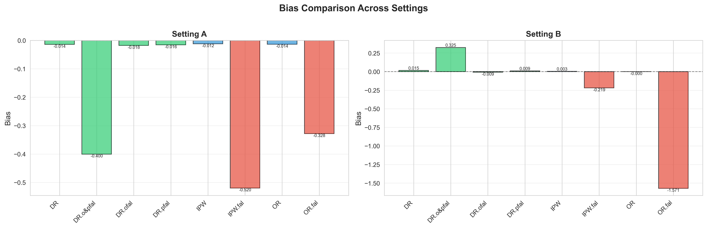
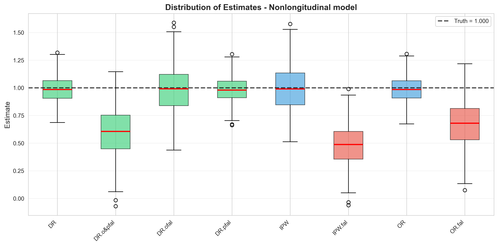
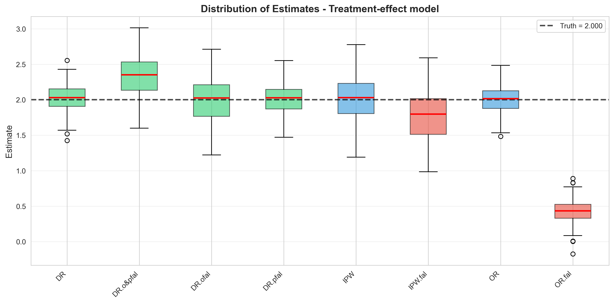

---
output:
  pdf_document: default
  html_document: default
---

## Results visualization

# Analysis

### How well did you reproduce the original results? What differed?

I reproduced almost the same as the original paper.

## Evaluate the neutrality of the simulation design:

### Were the simulation conditions fair to all methods being compared? Did they ignore important predecessors?

Yes I think it is fair.

### Were there any design choices that favored certain methods?

No.

### Were realistic scenarios included, or only idealized conditions?

This work considers the robustness under model misspecification, so I think it includes the realistic scenarios where we don't know the exact true model.

### What would you change about the simulation design? Why?

I think it is already a good design, reflecting what the author intended to show with reasonable settings.

### Did you recreate the visualizations or make your own? What did the visualizations reveal that the original paper missed or undersold?

I create the visualizations by my own, the paper only has numerical tables. I added the boxplot and bias comparison, and I think the plottings are much more intuitive to interpret and understand than tables. One thing interesting is that my work submitted to the same journal (Biometrics) are suggested to add some boxplots and that is exactly what I did here.

### What was surprising or unexpected in the results?

I think the results are expected. At the beginning I calculated the truth wrong, so got unexpected bias, variance and IQR results. But later I figured that out and all the results are expected.