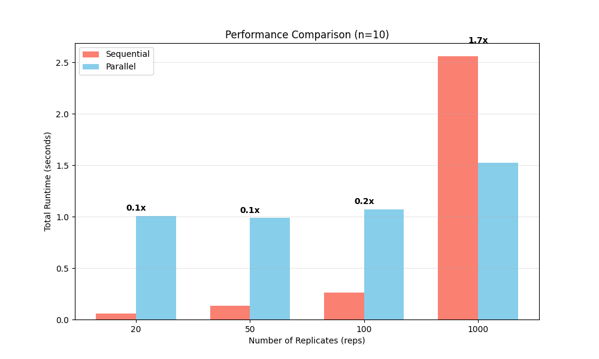
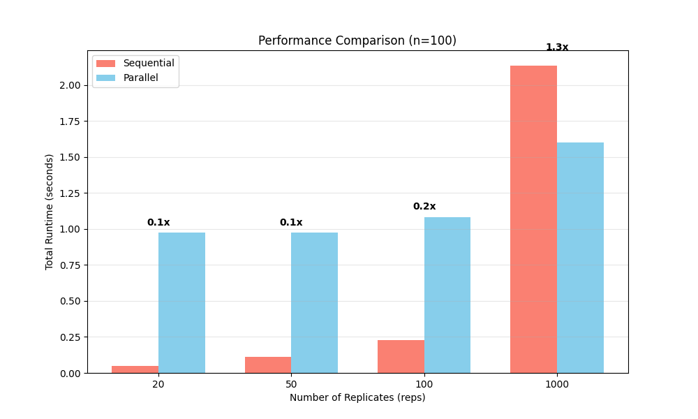
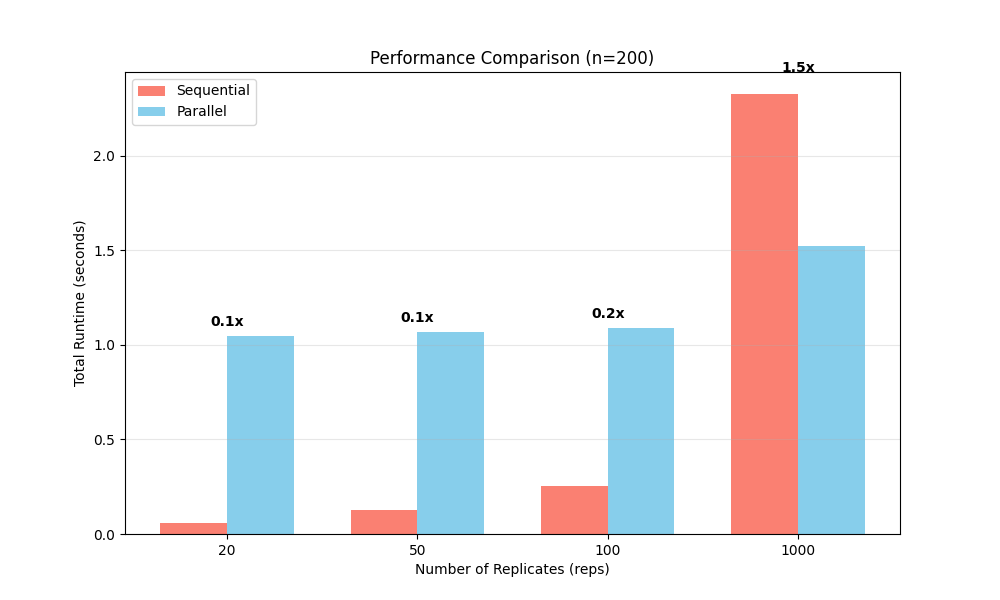
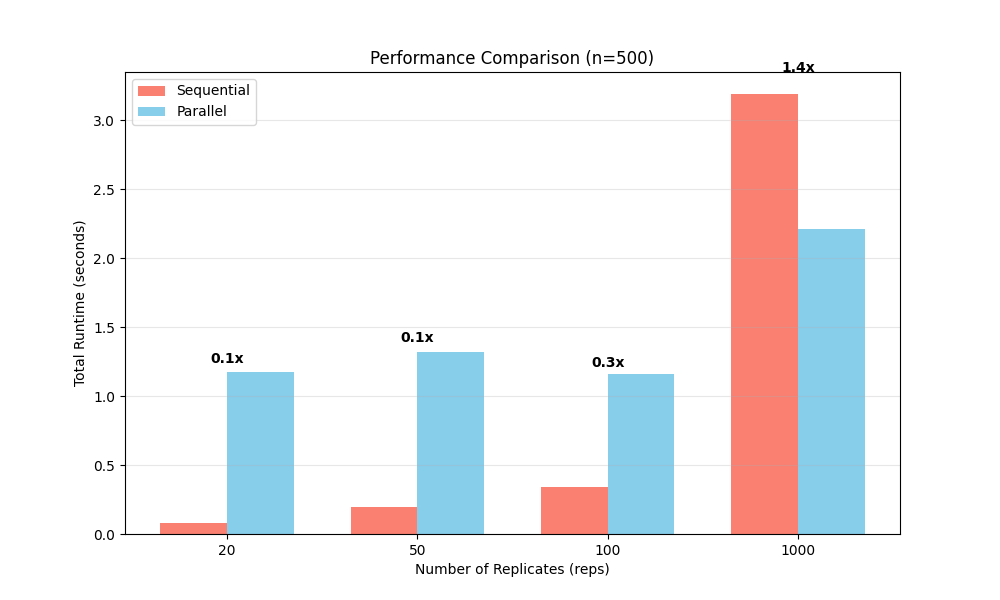
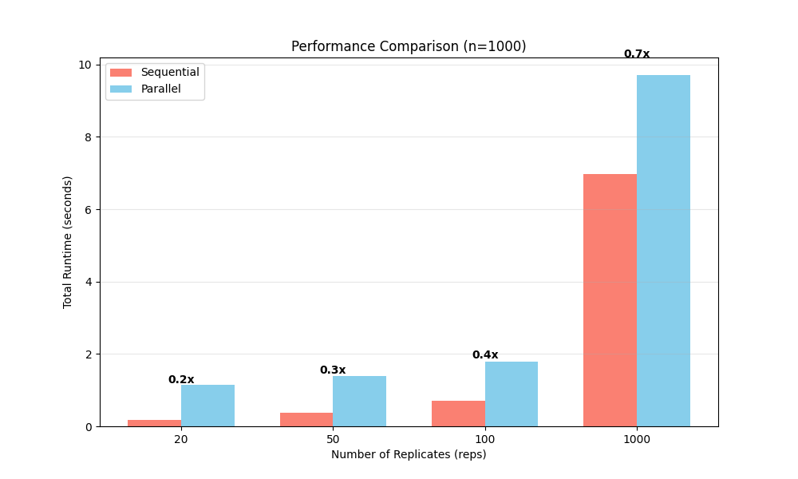

# Optimization Documentation

This document details the optimization strategies applied to the simulation study, following the profiling analysis in `docs/BASELINE.md`.

## Strategy 1: Parallelization through multiprocessing

### Problem Identified
Profiling revealed that the simulation logic for each replicate was executing sequentially. With multiple simple replicates (`reps=100` or more), the total runtime scaled linearly with the number of replicates, underutilizing the available CPU cores on modern multi-core machines. Though I know it's a simple calculation so I do not expect some or much improvement due to the cost of two ends, I still want to parallelize it to show the benefits of parallelization and how reps and dims impact the speedup.

### Solution Implemented
We implemented **process-based parallelism** using Python's `concurrent.futures.ProcessPoolExecutor`.
1.  Refactored the simulation loop into a pure function `_run_single_replicate` to ensure it is picklable.
2.  Replaced the sequential `for` loop with `executor.map()`.
3.  Implemented thread-safe result collection.

### Code Comparison

**Before (Sequential):**
```python
# simulation_old.py
for r in range(reps):
    # ... generate data ...
    # ... run methods ...
    rows.append(res)
```

**After (Parallel):**
```python
# simulation.py
with ProcessPoolExecutor(max_workers=n_jobs) as executor:
    results = executor.map(worker, range(reps))
    for batch in results:
        rows.extend(batch)
```

### Performance Impact
Parallelization provided significant speedups, particularly as the workload (number of replicates) increased.

*   **Small Workload (reps=20, 100)**: Speedup < 1x (slower due to process startup overhead).
*   **Large Workload (reps=1000)**: Speedup **~1.5x to 1.75x**.
*   **Performe differently with different matrix dimensions n.**. But I am surprised that the speedup is less effective as n grows larger.

**Visualization:**







### Trade-offs
*   **Cost**: Higher memory usage (multiple Python processes) and initialization overhead.
*   **Benefit**: Drastic reduction in wall-clock time for large-scale simulations.

---

## Strategy 2: Numerical Stability

### Problem Identified
The simulation involves Iteratively Reweighted Least Squares (IRLS) for logistic regression and OLS for outcome regression.
1.  **Singular Matrices**: Randomly generated data (or bootstrap samples) can lead to singular or near-singular design matrices ($X^T X$), causing `numpy.linalg.LinAlgError` or numerically unstable solutions.
2.  **Sigmoid Overflow**: Standard sigmoid implementations can overflow for large inputs ($e^x$).

### Solution Implemented
We created a robust version of the methods in `src/methods_stable.py`:
1.  **Robust Sigmoid**: Replaced manual implementation with `scipy.special.expit`, which handles overflow gracefully.
2.  **Matrix Inversion Fallback**: Wrapped `np.linalg.solve` in a `try-except` block. If a singular matrix error occurs, it falls back to `np.linalg.pinv` (Moore-Penrose pseudo-inverse).

### Code Comparison

**Before (Unstable):**
```python
# methods.py
def _ols_fit(X, y):
    return np.linalg.solve(X.T @ X, X.T @ y)
```

**After (Stable):**
```python
# methods_stable.py
def _ols_fit(X, y):
    XtX = X.T @ X + ridge
    try:
        return np.linalg.solve(XtX, X.T @ y)
    except np.linalg.LinAlgError:
        return np.linalg.pinv(XtX) @ (X.T @ y)
```

### Performance & Stability Impact
We verified stability using a stress test with perfect collinearity (Singular Matrix) and Zero Columns. But seemingly the previous implementation is also stable, and the results are the same after optimization.

**Stability Report (`results/stability_report.txt`):**
```text
=== 3. Stability Check (Singular Matrix) ===
Scenario A: Perfect Collinearity (x2 = 2*x1)
  [Unstable Method]:
    Result: Returned a result (likely unreliable) -> [0.61242816 1.22485104]
  [Stable Method]:
    Result: SUCCESS (Handled via pseudo-inverse) -> [0.61242816 1.22485104]

Scenario B: Zero Column (Matrix Rank Deficient)
  [Unstable Method]:
    Result: Returned a result -> [3.06213025 0.        ]
  [Stable Method]:
    Result: SUCCESS (Handled via pseudo-inverse) -> [3.06213025 0.        ]
```
*Note: In some environments, LAPACK solvers may return garbage for singular matrices instead of raising errors. The stable method explicitly guarantees a valid least-squares solution via pseudo-inverse.*

### Trade-offs
*   **Cost**: `try-except` blocks and pseudo-inverse calculations are slightly slower than direct solving.
*   **Benefit**: The simulation will not crash during long runs even if edge-case datasets are generated.

---

## Correctness Verification (Regression Tests)

To ensure these optimizations did not alter the statistical correctness of the simulation, we implemented a regression test suite (`tests/test_regression.py`).

*   **Method**: Compare the DataFrame output of `simulation_old.py` (Sequential/Unstable) vs `simulation.py` (Parallel/Stable) using identical random seeds.
*   **Result**: `SUCCESS: Results match exactly.`

## Lessons Learned

1.  **Overhead Matters**: Parallelization is not a magic bullet. For small tasks ($N=100, Reps=10$), the overhead of spawning processes outweighed the compute benefits. It is most effective for heavy workloads.
2.  **Profiling First**: Identifying that the main loop was the bottleneck justified the effort to parallelize it.
3.  **Stability**: I should make some tests to verify the stability of the methods as some python impletation may be different from what I expect or know.